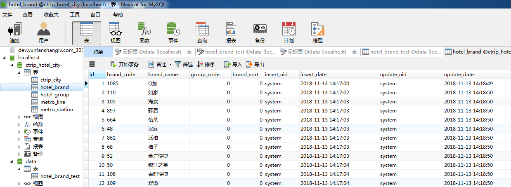

# **file_regEx_mysql_io**

>desc: 从txt文件中读取字符串，通过正则表达式提取关键字，并插入mysql数据库的一个小demo. 

## 前言

​	因为最近公司需要用到携程上面的一些酒店数据，由于没有接触过爬虫，所以只能投机取巧去爬html源文件的代码，然后在源代码里面提取酒店的数据。

​	大概画风如下：


​	一开始想想既然都是`div`,那就可以直接通过javascript中的DOM操作，来直接获取`div`元素中的属性值，然后将属性值传递输出到`body`元素中，把属性直接打在页面上，然后通过excel批量插入，再直接转移到navicat上插入数据库即可。

### Javascript方法 

#### 1. javascript的DOM操作

```javascript
<script type="text/javascript">
window.onload = function(){ 
//function getHasTitles(parentNode) {
    var allNodes = document.getElementsByTagName('div');
    var length = allNodes.length;
    var i;
    var hasTitles = [];
    var node;
    // for (i = 0; i < length; i++) {
    //     node = allNodes[i];
    //     if (node.title) {
    //         //hasTitles.push(node);
    //         console.log(node.getAttribute('title'));
    //     }
    var str;
    var a='';
          for(var i=0; i<length ;i++){
          	  
              node = allNodes[i];
            //	if (node[data-value]) {
             //hasTitles.push(node);
              a = node.getAttribute('data-value');
              str += '<div>'+a+'</div>'; //拼接str
         // }
          
    }
    for(var i=0; i<length ;i++){
          	  
              node = allNodes[i];
            //	if (node[data-value]) {
             //hasTitles.push(node);
              a = node.getAttribute('data-brandtype');
              str += '<div>'+a+'</div>'; //拼接str
         // }
          
    }
    document.getElementById('container').innerHTML=str;
    //return hasTitles;
}

/*var hasTitles = getHasTitles(document);
for (var i = 0; i < hasTitles.length; i++) {
	console.log(hasTitles[i].getAttribute('id'));
}*/
//}
</script>
```

#### 2. 在html文件中获取所需要的属性


#### 3. 然后将数据批量复制插入excel表格中


#### 4. 最后直接将excel表格直接批量复制到navicat中实现批量插入处理



### Java方法

​	做人说到底还是向惰性屈服，现在又觉得好像上面需要用excel做中转很麻烦，想想用一下正则表达式来逐行读取文本，然后提取关键信息插入mysql数据库，一步到位，想想都有点小激动。

#### 1. 读取文本然后通过正则表达式过滤出关键信息

```java
public class cin_txt {  
	public static void main(String args[]) {  
		
		try { // 防止文件建立或读取失败，用catch捕捉错误并打印，也可以throw  
  
            //读入TXT文件  
            String pathname = "beijing.txt"; // 绝对路径或相对路径都可以，这里是绝对路径，写入文件时演示相对路径  
            File filename = new File(pathname); // 要读取以上路径的input.txt文件  
            InputStreamReader reader = new InputStreamReader(  
                    new FileInputStream(filename)); // 建立一个输入流对象reader  
            BufferedReader br = new BufferedReader(reader); // 建立一个对象，它把文件内容转成计算机能读懂的语言  
            String line = "";  
            line = br.readLine();  
            while (line != null) {  
                line = br.readLine(); // 一次读入一行数据  
                if(line != null) {
                //String regEx = "(?=[\\s\\S]*?)(\\[smiley=[0-9]+\\])(?=[\\s\\S]*?)";
        		//String regEx ="data-value='([0-9]+)'([\\s\\S]*?)title='([\\u4e00-\\u9fa5_a-zA-Z0-9]+)'";
                String regEx ="data-value='([0-9]+)'([\\s\\S]*?)title='([\\S]+)'";	
        		//String str = "adfasdf[smiley=4]kk [smiley=1]   mko[smiley=2],sdfaasdfa fd";
        		//String str = "<div data-dopost='T' data-type='brand' data-value='1085' id='brand-1085' data-brandtype='0' title='Q加' class='optionList-item  '>Q加</div>";
        		Pattern pat = Pattern.compile(regEx);
        		Matcher mat = pat.matcher(line);
        		while(mat.find()){
        			Dao.add(mat.group(1),mat.group(3));
        		}
                }
            }  
            br.close();
            System.out.println("插入成功");
        } catch (Exception e) {  
            e.printStackTrace();  
        }  
    }  
}  
```

#### 2. 连接mysql，插入关键字

```java
public class Dao {
	private static final String USER = "root";
	private static final String PASSWD = "123456";
	private static final String URL = "jdbc:mysql://localhost:3306/data?useUnicode=true&characterEncoding=utf8&serverTimezone=GMT%2B8&useSSL=false";
	
	public static void add(String value,String title) throws SQLException {
		//  1、注册数据库的驱动,使用反射注册驱动
        try {
			Class.forName("com.mysql.cj.jdbc.Driver");
		} catch (ClassNotFoundException e) {
			e.printStackTrace();
		}
        Connection connection = null;
         //2、获得数据库的连接访问权限
        try {
			connection = DriverManager.getConnection(URL, USER, PASSWD);
        } catch (SQLException e) {
			e.printStackTrace();
		}
         //3、向数据库发送执行的SQL执行语句
        PreparedStatement pstmt;
        
        	String sql = "insert into hotel_brand_test(brand_value,title) Values(?,?) ";
        	pstmt = (PreparedStatement) connection.prepareStatement(sql);
        	pstmt.setString(1, value);
            pstmt.setString(2, title);
            pstmt.executeUpdate();
         //5、关闭数据库连接
		 try {
			pstmt.close();
			connection.close();
		} catch (SQLException e) {
			// TODO Auto-generated catch block
			e.printStackTrace();
		}       
	}
}

```

#### 3. 大功告成


